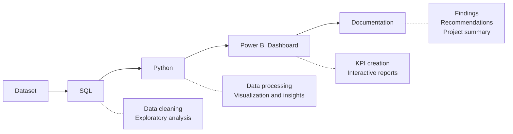

# UPI Transaction Performance Analysis

An end-to-end data analytics project on 1,000 UPI payment transactions. I used **SQL** to answer business questions, **Python (Pandas)** for cleaning and exploratory analysis, and **Power BI** to build an interactive dashboard that tracks payment reliability, failure patterns and bank-to-bank money flow.

**Tools:** MySQL · Python (Pandas, Matplotlib) · Jupyter Notebook · Power BI (DAX) · draw.io

---

## Table of Contents
1. [Project Overview](#1-project-overview)
2. [Business Problem](#2-business-problem)
3. [Dataset](#3-dataset)
4. [Project Workflow](#4-project-workflow)
5. [Repository Structure](#5-repository-structure)
6. [SQL Analysis](#6-sql-analysis)
7. [Python Analysis](#7-python-analysis)
8. [Power BI Dashboard](#8-power-bi-dashboard)
9. [Key Findings](#9-key-findings)
10. [Recommendations](#10-recommendations)
11. [Limitations](#11-limitations)
12. [How to Run](#12-how-to-run)
13. [Author](#13-author)

---

## 1. Project Overview
UPI is one of India's most widely used payment systems, and a failed payment means a frustrated customer and money stuck in limbo. This project analyses a month of UPI transactions to find out **how reliable the payments are, where and when they fail, and how money moves between banks.**

The same 10 business questions are answered three times, in SQL, in Python and in Power BI, so the results can be cross-checked and presented to different audiences.

## 2. Business Problem
Almost half of the transactions in this dataset fail. The business needs to understand:

1. How reliable is the payment system, and how much money is stuck in failed payments?
2. Which sender banks fail the most?
3. When do people pay the most, and when do payments fail the most?
4. Does the transaction amount influence failure?
5. How does money flow between banks, and are there weak routes?
6. Is the business growing, and is anything suspicious in the data?

The full list of 10 questions is in [`business_problem_questions.txt`](business%20problem%20questions.txt).

## 3. Dataset

| Property | Value |
|---|---|
| File | [`data/transaction_dataset.csv`](data/transaction_dataset.csv) |
| Rows | 1,000 transactions |
| Period | 4 Jun 2024 to 3 Jul 2024 (30 days) |
| Status split | 502 SUCCESS · 498 FAILED |
| Banks (UPI handles) | `okaxis`, `okhdfcbank`, `okicici`, `oksbi`, `okybl` |

**Columns**

| Column | Description |
|---|---|
| `transaction_id` | Unique ID of the transaction |
| `timestamp` | Date and time of the payment |
| `sender_name`, `sender_upi_id` | Who paid, and their UPI ID |
| `receiver_name`, `receiver_upi_id` | Who received, and their UPI ID |
| `amount (INR)` | Payment amount in rupees |
| `status` | `SUCCESS` or `FAILED` |

**Derived columns** (created in Python and Power BI): `hour`, `day_name`, `date`, `sender_bank` and `receiver_bank` (the text after `@` in the UPI ID), `is_failed` (1 if FAILED, else 0) and `amount_bucket` (0-2,500 · 2,500-5,000 · 5,000-7,500 · 7,500+).

## 4. Project Workflow



The editable diagram is in [`docs/Analysis_Flow_Diagram.drawio`](docs/Analysis_Flow_Diagram.drawio).

## 5. Repository Structure

```
upi-transaction-analysis/
├── README.md
├── data/
│   └── transaction_dataset.csv
├── sql/
│   ├── database_creation.sql
│   └── business_problem_solution_using_sql.sql
├── python/
│   └── upi_python_analysis.ipynb
├── powerbi/
│   └── UPI_Dashboard.pbix
├── images/
│   ├── dashboard_overview.png
│   ├── failure_analysis.png
│   └── bank_flow.png
└── docs/
    ├── Analysis_Flow_Diagram.drawio
    └── business_problem_questions.txt
```

## 6. SQL Analysis
**Files:** [`sql/database_creation.sql`](sql/database_creation.sql) and [`sql/business_problem_solution_using_sql.sql`](sql/business_problem_solution_using_sql.sql) (MySQL)

I created the `upi` database and a `transactions` table, loaded the CSV, and wrote one query (or more) for each of the 10 business questions.

**Skills used**

| Technique | Where it was used |
|---|---|
| `CASE WHEN` with `SUM` / `COUNT` | Failure rate, success amount, amount buckets |
| String functions (`SUBSTRING_INDEX`) | Extracting the bank name from the UPI ID |
| Date functions (`HOUR`, `DAYNAME`, `DATE`) | Peak hour and weekday analysis |
| `GROUP BY` with `HAVING` | Repeat senders |
| CTEs | Daily trend, outlier detection |
| Window functions (`LAG`) | Day-over-day change |

**Example: failure rate by sender bank**

```sql
SELECT
    SUBSTR(sender_upi_id, INSTR(sender_upi_id, '@') + 1) AS sender_bank,
    COUNT(*) AS total_txns,
    SUM(CASE WHEN status = 'FAILED' THEN 1 ELSE 0 END) AS failed_txns,
    ROUND(100.0 * SUM(CASE WHEN status = 'FAILED' THEN 1 ELSE 0 END) / COUNT(*), 2) AS failure_rate_pct
FROM transactions
GROUP BY sender_bank
ORDER BY failure_rate_pct DESC;
```

## 7. Python Analysis
**File:** [`python/upi_python_analysis.ipynb`](python/upi_python_analysis.ipynb)

The notebook walks through the analysis step by step:

1. **Load the data** with `pd.read_csv()`, then inspect it with `head()`, `shape` and `info()`.
2. **Clean the data** by renaming columns, converting `timestamp` to datetime, and checking nulls and duplicates (none found).
3. **Engineer features** such as hour, weekday, sender bank, receiver bank, `is_failed` and amount buckets.
4. **Answer the 10 business questions** using `groupby`, `agg`, `pivot_table` and Matplotlib charts, each with a one-line insight.

The Python results were cross-checked against the SQL results to confirm the analysis is consistent.

## 8. Power BI Dashboard
**File:** [`powerbi/UPI_Dashboard.pbix`](powerbi/UPI_Dashboard.pbix)

The dashboard has 3 pages, and all slicers and visuals are interactive.

### Page 1: Dashboard (overview)
KPI cards for total transactions, failure rate, success amount and average ticket size, plus the daily transaction trend and transactions by day of the week.


### Page 2: Failure Analysis
Total failed amount, failed amount by sender bank, failure rate by hour compared with the overall average, and failure rate by amount bucket.


### Page 3: Bank Flow
A sender-bank × receiver-bank heatmap (matrix with a colour scale) and a detail table with transactions, success amount and failure rate for each route.


### Key DAX measures

```DAX
Total Txns = COUNTROWS(transactions)

Failed Txns = CALCULATE([Total Txns], transactions[status] = "FAILED")

Success Txns = CALCULATE([Total Txns], transactions[status] = "SUCCESS")

Failure Rate % = DIVIDE([Failed Txns], [Total Txns])

Success Amount = CALCULATE(SUM(transactions[amount_inr]), transactions[status] = "SUCCESS")

Failed Amount = CALCULATE(SUM(transactions[amount_inr]), transactions[status] = "FAILED")

Avg Ticket Size = DIVIDE([Success Amount], [Success Txns])

Overall Failure Rate = CALCULATE([Failure Rate %], ALL(transactions))
```

## 9. Key Findings

| # | Question | Finding |
|---|---|---|
| 1 | Payment reliability | **49.8%** of transactions fail (498 of 1,000). About **₹24.59 lakh** is stuck in failed payments, almost as much as the ₹25.40 lakh that went through. |
| 2 | Failures by sender bank | `okaxis` fails the most (**54.04%**), followed by `okhdfcbank` (52.66%). `oksbi` is the lowest at 46.89%. Axis also has the highest failed amount (about ₹5.45 lakh). |
| 3 | Peak payment times | Hour **11** is the busiest (56 transactions), followed by hour 7 (50) and a tie between hours 16 and 20 (49 each). **Tuesday** is the busiest weekday (186) and **Sunday** the quietest (117). |
| 4 | When payments fail | Failure rates peak at hour **4 (63.4%)**, hour **16 (63.3%)** and hour 18 (61.4%), and are lowest at hour **7 (28.0%)**. |
| 5 | Effect of amount | Failure rate is almost the same in every bucket (**46.9% to 51.8%**), so the amount is **not** a driver of failure. |
| 6 | Money moved | **₹25,39,557.69** moved successfully. Average ticket **₹5,058.88**, smallest ₹53.13, largest ₹9,993.06. |
| 7 | Bank-to-bank flow | The busiest route is `okybl → okhdfcbank` (56 transactions), but it fails **62.5%** of the time, the weakest high-volume route. The highest successful value is `oksbi → oksbi` (₹1,40,867). |
| 8 | Repeat users | Only 3 sender names appear twice, and every UPI ID is unique, so these are likely different people with the same name, not repeat customers. |
| 9 | Growth trend | Daily volume ranges from 25 (5 Jun) to 45 (25 Jun) and averages about 33 per day, so business is **flat**. The biggest drop was on 26 Jun (-19) and the biggest rise on 7 Jun (+13). |
| 10 | Suspicious patterns | **None found.** There were no duplicate transaction IDs, no self-payments and no outliers above mean + 2 standard deviations. The data is clean. |

## 10. Recommendations
1. **Investigate the weakest banks first.** `okaxis` and `okhdfcbank` fail above the 49.8% average, so review them with the bank partners.
2. **Fix the `okybl → okhdfcbank` route.** It has the most traffic and a 62.5% failure rate, so it has the highest impact.
3. **Add retry or fallback logic around hours 4, 16 and 18**, where failure rates are highest, and keep monitoring hourly failure rates.
4. **Look beyond the amount.** Since failure does not depend on amount, check other causes such as network issues, bank downtime and app errors.
5. **Capture a failure reason code** for every failed payment. Without it, the analysis shows where failures happen but not why.
6. **Track results over a longer period** (3 to 6 months) to confirm the patterns and measure real growth.

## 11. Limitations
- The data covers only **30 days** and 1,000 transactions, so conclusions about trends are limited.
- With about 40 transactions per hour, **hourly failure rates are noisy** and should be treated as directional.
- The dataset has **no failure reason**, so root causes cannot be identified.
- Sender names are not unique identifiers (UPI IDs are), so the repeat-user analysis is indicative only.
- Amounts include paise (decimals). Use `DECIMAL(10,2)` in the database so SQL totals match the Python and Power BI totals.

## 12. How to Run

**SQL (MySQL)**
1. Run `sql/database_creation.sql` to create the database and table.
2. Import `data/transaction_dataset.csv` into the `transactions` table.
3. Run `sql/business_problem_solution_using_sql.sql`.

**Python**
```bash
pip install pandas matplotlib notebook
jupyter notebook
```
Open `python/upi_python_analysis.ipynb` and keep `transaction_dataset.csv` in the same folder (or update the path in the first cell). Run the cells from top to bottom with **Shift + Enter**.

**Power BI**
Open `powerbi/UPI_Dashboard.pbix` in Power BI Desktop. If the data source path breaks, go to **Transform data → Data source settings** and point it to `data/transaction_dataset.csv`.

## 13. Author
**Aayush Kumar Jha**, aspiring Data Analyst based in Delhi, India

- LinkedIn: [linkedin.com/in/aayushkumar-jha-84b7753bb](https://linkedin.com/in/aayushkumar-jha-84b7753bb)
- GitHub: [github.com/databyaayush](https://github.com/databyaayush)
- Portfolio: [databyaayush.github.io/myPortfolio](https://databyaayush.github.io/myPortfolio/)
- Email: aayush.jha.working@gmail.com
